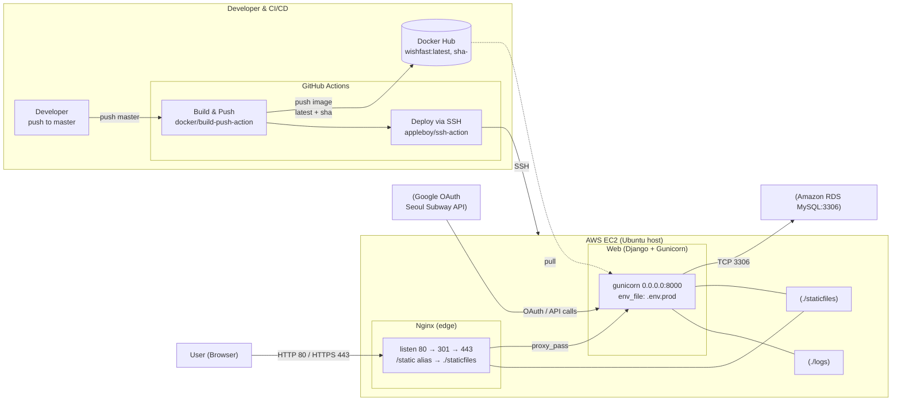
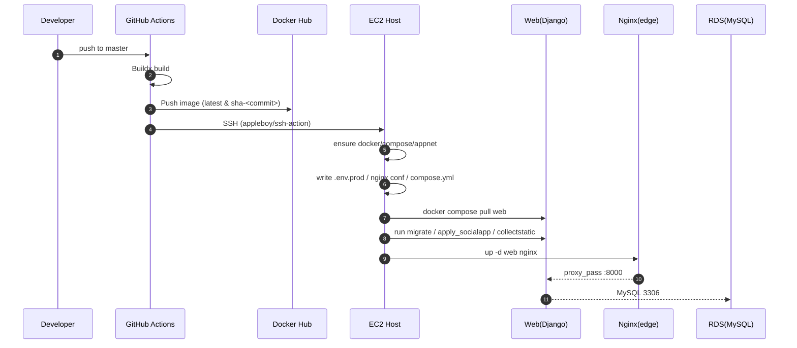

# project-wishfast

 

### 1) 아키텍처 개요 (Flowchart)

 

```mermaid
flowchart LR
  %% ===== Clusters =====
  subgraph Dev["Developer & CI/CD"]
    A[Developer<br/>push to master]
    subgraph GHA["GitHub Actions"]
      B[Build & Push<br/>docker/build-push-action]
      D[Deploy via SSH<br/>appleboy/ssh-action]
    end
    HUB[(Docker Hub<br/>wishfast:latest, sha-<commit>)]
  end

  subgraph EC2["AWS EC2 (Ubuntu host)"]
    subgraph EDGE["Nginx (edge)"]
      N1["listen 80 → 301 → 443<br/>/static alias → ./staticfiles"]
    end
    subgraph WEB["Web (Django + Gunicorn)"]
      W1["gunicorn 0.0.0.0:8000<br/>env_file: .env.prod"]
    end
    SF["(./staticfiles)"]
    LG["(./logs)"]
  end

  RDS["(Amazon RDS MySQL:3306)"]
  EXT["(Google OAuth<br/>Seoul Subway API)"]

  %% ===== Flows =====
  A -->|push master| B
  B -->|push image<br/>latest + sha| HUB
  D -->|SSH| EC2
  B --> D
  HUB -. pull .-> W1

  %% Inbound traffic
  U["User (Browser)"] -->|HTTP 80 / HTTPS 443| N1
  N1 -->|"proxy_pass <http://web:8000>"| W1
  W1 -->|TCP 3306| RDS
  EXT -->|OAuth / API calls| W1

  %% Volumes
  N1 --- SF
  W1 --- SF
  W1 --- LG
```

 

    

### 2) 배포 파이프라인(Sequence)

 

```mermaid
sequenceDiagram
  autonumber
  participant Dev as Developer
  participant GHA as GitHub Actions
  participant Hub as Docker Hub
  participant EC2 as EC2 Host
  participant Web as Web(Django)
  participant Nginx as Nginx(edge)
  participant RDS as RDS(MySQL)

  Dev->>GHA: push to master
  GHA->>GHA: Buildx build
  GHA->>Hub: Push image (latest & sha-<commit>)
  GHA->>EC2: SSH (appleboy/ssh-action)
  EC2->>EC2: ensure docker/compose/appnet
  EC2->>EC2: write .env.prod / nginx conf / compose.yml
  EC2->>Web: docker compose pull web
  EC2->>Web: run migrate / apply_socialapp / collectstatic
  EC2->>Nginx: up -d web nginx
  Nginx-->>Web: proxy_pass :8000
  Web-->>RDS: MySQL 3306
```